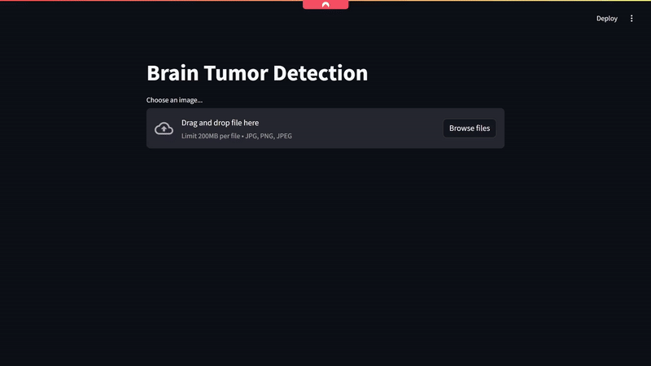

# Brain Tumor Detection Application

This project is a web application for detecting brain tumors from uploaded images. It utilizes pre-trained YOLO models to analyze images and identify potential tumors. The application is built using Streamlit, OpenCV, and PyTorch.

## How It Works




1. **Image Upload:**
   The user uploads an image through the Streamlit interface.

2. **Tumor Detection:**
   - The image is passed to `model1` to get a probability score.
   - The image is then passed to `model2` for segmentation to detect any masks indicating tumors.
   - If the difference between the probability scores is significant or if masks are detected, the image is processed to highlight the tumor.

3. **Results Display:**
   - If a tumor is detected, the application displays the original image with the tumor overlay and the tumor mask.
   - If no tumor is detected, the application displays a message indicating no tumor was found.


## Features

- Upload an image file (jpg, png, jpeg)
- Detect brain tumors using two different YOLO models
- Display the original image with the detected tumor overlay
- Display the mask of the detected tumor

## Installation

To run this application locally, follow these steps:

1. **Clone the repository:**

   ```sh
   git clone https://github.com/probablyanek/MRI-Segmentation.git
   cd MRI-Segmentation
   ```

2. **Install the required dependencies:**

   Ensure you have Python 3.7+ installed, then run:

   ```sh
   pip install -r requirements.txt
   ```

3. **Download the pre-trained models:**

   Place your pre-trained YOLO models in the `./models` directory. The model files should be named `model1.pt` and `model2.pt`.

## Usage

To start the Streamlit app, run:

```sh
cd main
streamlit run app.py
```

This will launch the web application in your default web browser. You can then upload an image to detect brain tumors.


## Contributing

Contributions are welcome! If you have any ideas, suggestions, or bug fixes, feel free to submit a pull request.

## License

This project is licensed under the MIT License.

## Acknowledgements
- This application was built using [Streamlit](https://streamlit.io/) and [OpenCV](https://opencv.org/).

---
